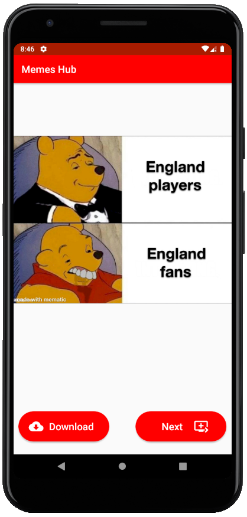

# MemesHub_Android-App
Fetching memes from reddit using an API 
Implemented volley and glide library to fetch images from API and present it to screen 
Developed in Kotlin 
Link for App- https://drive.google.com/file/d/12mTjzINfTkCevDpKCtqHxDanNdkIDgGH/view?usp=sharing
  

